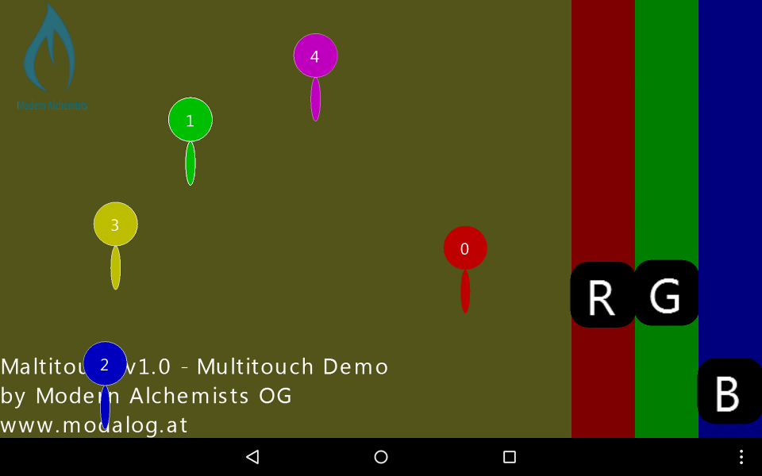
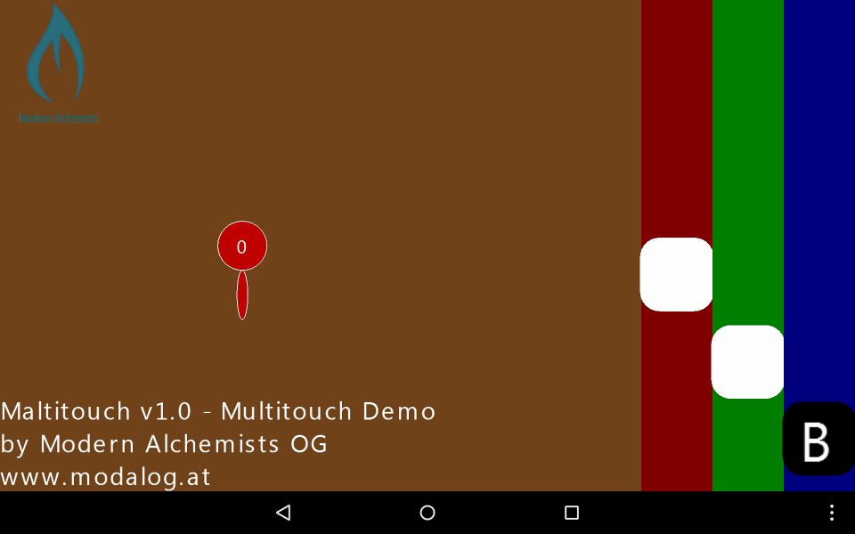
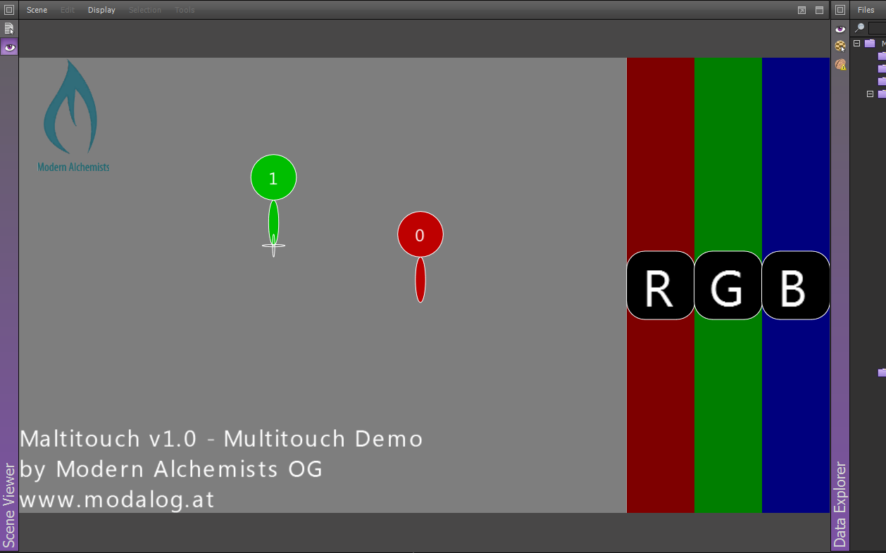

# Modern Alchemists' Maltitouch v1.0





*Maltitouch* is a library and library demo which provides real multitouch support for the Shiva 1.9 engine.
The problem with Shivas ```onTouchSequenceChange``` is that the indices of the fingers change if a another finger is added or removed:

  1. finger0 down => nTaps0=1 nTaps1=0
  2. finger1 down => nTaps0=1 nTaps1=0
  3. finger0 up   => nTaps0=1(!) nTaps1=0
  4. finger0 down => nTaps0=1 nTaps1=0 (nTaps0 tracks finger0 again though)

Our solution was to keep track of each finger position and if the number of fingers changes, calculate the distances to each tap and reassign the most likely tap index.

For easier development this demo also provides a simple Multitouch emulation via mouse and keyboard.

## Usage

  1. Add ```Multitouch.aim``` AIModel to your project and as user AIModel
  2. ```user.setAIVariable( this.getUser(), "Multitouch", "sAiModel", "YOUR_AI_MODELNAME" )```
  3. Touches are sent to ```onFingerDown()```, ```onFingerUp()``` and ```onFingerMoved()``` handlers
  4. In ```onFingerDown()``` you have to set ```user.setAIVariable( this.getUser(), "Multitouch", "fingerName", "FINGER_NAME" )```. This identifies the finger for subsequent calls and is used to differenciate between use-cases like "finger in scene", "finger on HUD" etc.

## Related work

* [JPMultiTouch](http://www.shiva3dstore.com/index.php?route=product/product&product_id=87) - no C++ support
* [JPMultiTouchSimulator](http://www.shiva3dstore.com/index.php?route=product/product&product_id=88) - no C++ support
* [Shiva Classic Additional Samples\TEST_Multitouch](http://www.shiva3dstore.com/index.php?route=product/product&product_id=143)
* Samples\iPhoneCharacterControl
* Samples\iPhoneCameraControl
